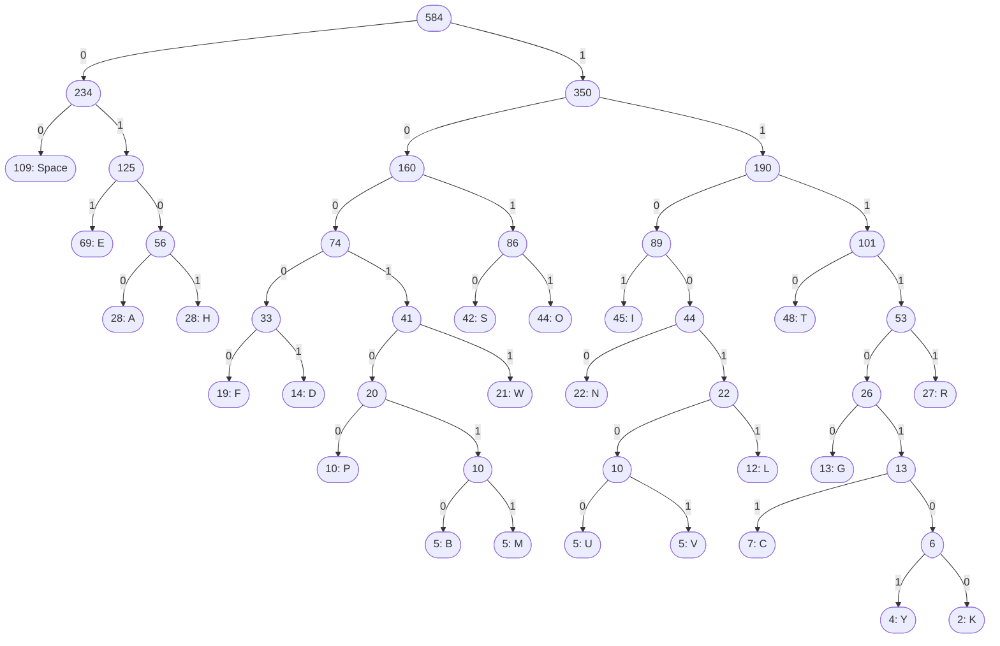

# Huffman Encoding

## Background

Character encoding has long been a critical component of electronic communication. Best known, perhaps, is _morse code_, which uses a series of dots and dashes to represent each character of the english alphabet (and sometimes also numbers and punctuation).

In the age of computers, there is also a need to create a standardized system of encoding text so that programmers and users can easily interface with a machine that operates on 0s and 1s. At least as far back as 1870 with the invention of Baudot 5-bit encoding, attempts have been at converting text to a computer-readable set of symbols.

For early computers, this was a significant challenge. Although morse code uses only two characters (dot and dash) to represent letters, the number of dots and dashes is not uniform: and "E" can be represented with just a single dot, while "Q" requires two dashes, a dot, and another dash. Without pausing between characters, morse code would devolve into an unintelligible soup. Thus, the "pause" is effectively the third character in morse code--bad news for computers which still only have two.

The solution still used today in the American Standard Code for Information Interchange (ASCII) is to standardize the width of each character. ASII encoding uses a bit width of 8, meaning each letter is represented by a sequence of 8 binary digits (one byte). Unfortunately, for early computers this was a problem: the memory demands were simply too high! The original UNIVAC computer built in 1951 could store only 48 kilobytes on a massive spinning drum. To store the average book, we'd need 10 such drums.

## Text Compression

Also in 1951, a process for shrinking the size of text was invented by David A. Huffman. _Huffman Coding_ uses a binary tree (not a heap) to allow variable character widths, with more frequently occuring characters being represented with just one or two bytes.

How is this possible? We begin by constructing a binary Huffman Tree (see the following section for how to do this) containing every letter in the text we want to decompress. From each node, a step to the left will be represented by a 0 and a step to the right will be a 1. Given a string of 0s and 1s representing a compressed string, we start at the root node and traverse the tree according to this rule until we hit an ending node. Only end nodes contain characters, so there is never any ambiguity: every sequence of 0s and 1s uniquely picks out a character, irrespective of length. Once we hit a character in the tree, we pick up with the next binary digit and start again from the root.

Below, is an example Huffman Tree constructed using the first paragraph of Charles Dicken's _Tale of Two Cities_ (note that, to save space, the left and right directions on a particular node have been flipped). In this example, the word "HELLO" would be encoded as "01010111100111100111011". In ASCII, this would have been "010010000100010101001100 0100110001001111" -- nearly twice as long!

## Building the Huffman Tree

Here are the steps to building a Huffman Tree:

1. Count the frequency of each character
2. For each character, create a node that stores the character value and its frequency.
3. Push all of these nodes to a min-ordered priority queue
4. Pop off the two least frequent nodes and create a new node that has these two as left and right children and the combined frequency of both.
5. Push this new node to the priority queue.
6. If there is more than one node left on the queue, go back to step 4. Otherwise, the one remaining node is the root of our tree.

## Generating the Codes

You may have noticed that the Huffman Tree is really terrible if we want to _encode_ text. We can build a dictionary linking characters to their codes by recursively traversing the tree:

1. Initialize an empty dictionary and begin traversing the tree from the root, tracking the path along the way.
2. Base case: if the current node is an ending node (i.e. it has a character in it), add the character and the path to the dictionary.
3. If not, recursively traverse the left code, adding a 0 to the path; then recursively traverse the righ node, adding a 1 to the path.
4. Return the resulting dictionary.

## Storing the Codes

So far, we've glossed over an important caveat to this method of encoding. To ensure optimality, we build the Huffman tree from the text we're trying to compress, so we need to store both the compression and the unique tree needed to decode it. If the text is long enough, this extra data will be smaller than the data saved with our encoding.

There are a number of ways to do this. For our purposes, we are going to use "Preorder Traversal" of the Huffman tree. You don't need to know what that is just yet; it's all taken care of for you in the HuffmanFile class.

## Assignment

For this assignment, you only need to edit one file: `huffman.py`. Inside, you will find the `HuffmanEncoding` class with several methods to implement:

1. `__init__(self,...)` Which initializes a Huffman encoding either from a source text or from an encoded text and the root of the corresponding Huffman tree.

2. `encoding(self)` which returns the encoded text as a `String` of 0s and 1s

3. `source_text(self)` which returns the original text of the encoding.

You are also given a helper function `build_dictionary()` which builds an easy translation dictionary from a given Huffman tree (see "Generating the Codes" above). _You don't need to do anything with this_. Just read the docstring and call it correctly. The same is true for the inner `Node` class. Your tree should be made up of these Nodes.